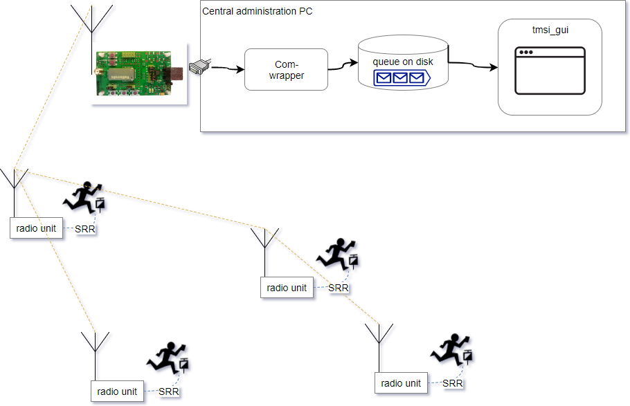

# Sportident online control using Tinymesh 169Mhz radio
A forest-optimized, reliable mesh radio for Sportident with up to 1,5km per hop.
This document introduces the project idea and product vision on a high level.
# Project context and background
In orienteering and other outdoor sports, the Sportident system is often used to electronically register when a participant passes a checkpoint. One drawback of Sportident is that the checkpoint pass time registrations cannot be read out until the participant has finished the course. In order to make sports using the Sportident system more exciting for the audience, there is a need for real-time communication from the checkpoints to the competition administration at the arena. A number of solutions already exist for this, such as the Radio Online Control, current loop signaling over military telephone wire, etc. While they each have their advantages, most solutions are a bit bulky which makes it burdensome to deploy more than a couple of online checkpoints in each race.
# Product vision
This project aims to produce a neat lightweight radio solution that is easy to deploy in forest conditions, while being very reliable in terms of delivering 100% of punches to the arena in all possible weather conditions. The finished product is a radio unit - a small box about the size of a fist - which is directly attached to a flexible 130 cm roll-up antenna. The antenna + radio unit can hang from a tree anywhere within 8m from the Sportident units at the control. No cabling is needed on the ground. No calibration of directional antennas is needed.
About 10 radio units including antennas can be carried in a backpack and easily deployed by one person with very limited technical knowledge. 
# Technologies used
## Tinymesh
The radio units communicate using a widely used and well supported mesh radio protocol from Radiocrafts called Tinymesh. They use the 169 MHz band, which implies wavelengths of almost 2 meters. Thus they have very good propagation even through dense and wet forest. Distances of over 1 km per hop have been tested with continuous operation. Tinymesh is a self-configuring, self-healing, monitorable mesh technology, implemented in a small surface-mounted component containing both transceiver and protocol logic. 
## Sportident Short Range Radio (SRR)
The Sportident units at the control are SRR stations, which communicate with the radio unit via a proprietary Sportident radio protocol on the 2,4 GHz band. 

# System design and architecture
Apart from the standard off-the-shelf Sportident SRR stations, the system consists of two main parts:
1. The neat field-deployable radio unit, of which there will be one per checkpoint. The radio unit receives punch data from the Sportident stations over 2,4 GHz, and retransmits it over the 169 MHz Tinymesh network. The Tinymesh network architecture has one central Gateway node to which all data is sent.
2. The Gateway, consisting of a Tinymesh radio module directly connected to a PC running our custom python application which parses the Tinymesh packets and forwards the Sportident punch data to the competition administration system. We intend to integrate with the OLA competition administration system using the SIRAP protocol.

## The radio unit

The radio unit is a small box of electronics with only one external connector for the SlimJim roll-up antenna. As mentioned, the antenna and the radio unit box are meant to hang from a tree nearby the checkpoint. Inside the box, there is a custom made printed
circuit board (PCB) with:
- a Sportident SRR receiver chip, which listens to 2,4GHz punch packets and sends them out over UART serial. 
- A Teensy-LC (a cheap small Arduino style microcontroller) receives the punch data and creates a Tinymesh data packet and passes it on to the Tinymesh radio module, again over UART serial. 
- The Tinymesh radio module sends the data packet with the punch data out on the Tinymesh network which forwards it to the gateway Tinymesh module. 
- The Teensy-LC microcontroller also buffers punches if the Tinymesh module should be busy, or if it is waiting for a free timeslot on the frequency. It also sends monitoring packets so that the central pc application can allways know all radio units are up and reachable.
- Two 18650 Lithium cells and a voltage regulator, serving the 3,3V needed by Tinymesh and Teensy-LC.

## The Gateway

This is the central part of the system that collects all punches from all controls and forwards them to the competition administration system. It also monitors the health and connectivity status of all controls. 
The Gateway is a PC running a Python application. A Tinymesh module configured as the gateway of the mesh network is connected to the PC. To save time, we have used the Tinymesh Devkit which has a USB connection and appears as a logical COM port in the PC. 
The Python application consists of two parts: a small simple script running as a separate process which just listens to the COM port of the Tinymesh gateway and writes every received packet to a store-and-forward queue. This queue is read by the main python application which parses each Tinymesh packet on the queue and handles it. Packets that are punch registrations are sent to the competition administration system using the SIRAP protocol. The application also has a GUI that shows status and health of each control, and any alarms. 

# Project progress and status

This has been completed so far:
1.	Selected and tested antenna solution. 1,5km hop reached with rollup slim-jim antenna. 
2.	Verified Tinymesh mesh radio network in real Orienteering competition using Tinymesh developer kits in July 2016. This used the serial data pass-through mode of Tinymesh.  
3.	Written pc application in python to receive and parse Tinymesh and Sportident packets. Use Tinymesh in packet mode, to monitor the health of the mesh network using the packet metadata and the various command packets of Tinymesh. This is the Gateway PC Application. 
4.	Designed and built a neat field-deployable radio unit with custom made printed circuit board (PCB), surface-mounted Tinymesh chip, battery, and a Teensy (a cheap small Arduino style microcontroller) for control logic.
5.	Written and tested Teensy code to simulate Sportident punches and send them to the Tinymesh radio module. Tested connectivity from the Teensy to the python application running on the PC, over Tinymesh radio.

# TODO
-	Add SRR-OEM chip to the design, sending its serial data at every punch to the Teensy.
-	Test end-to-end solution from punch in the Sportident station, over Tinymesh radio, to the python application on the PC.
-	Build more units and test a full mesh network. 

