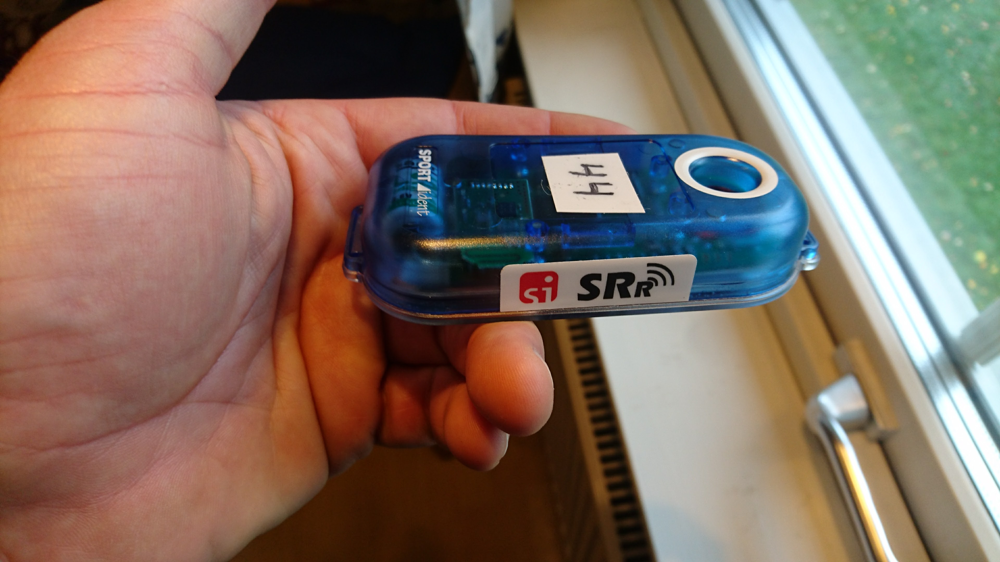
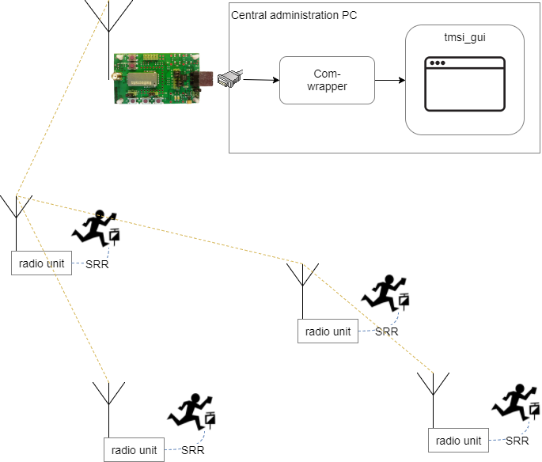
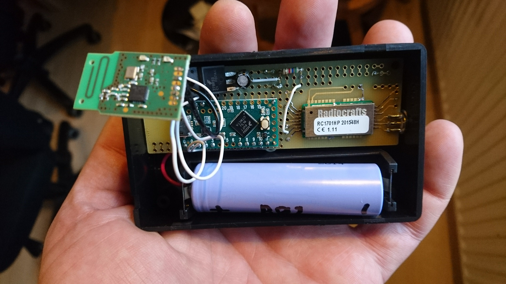
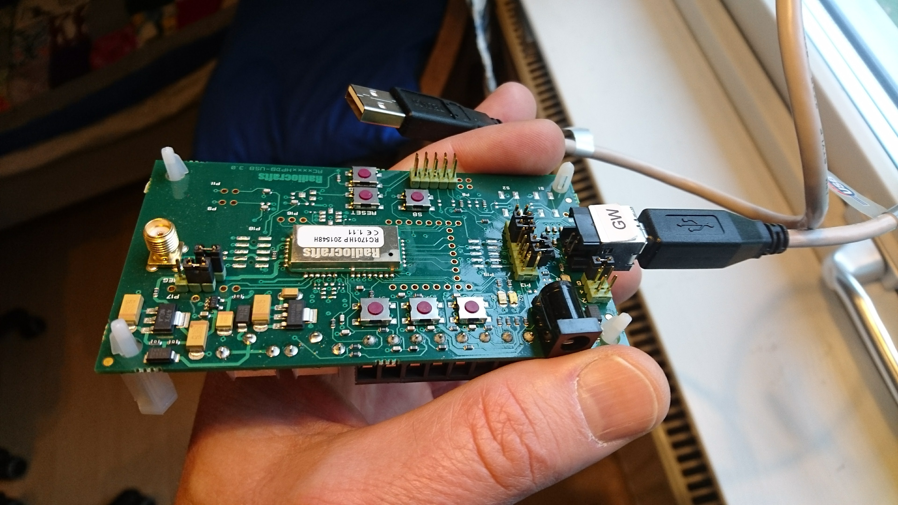

# Sportident online control using Tinymesh 169Mhz radio
A forest-optimized, reliable mesh radio for Sportident with up to 1,5km per hop.
This document introduces the project idea and product vision on a high level.
# Project context and background
In orienteering and other outdoor sports, the [Sportident](https://www.sportident.com/) system is often used to electronically register when a participant passes a checkpoint. One drawback of Sportident is that the checkpoint pass time registrations cannot be read out until the participant has finished the course. In order to make sports using the Sportident system more exciting for the audience, there is a need for real-time communication from the checkpoints to the competition administration at the arena. A number of solutions already exist for this, such as the excellent [Radio Online Control](http://olresultat.se/), current loop signaling over military [telephone wire](http://hem.bredband.net/sunjo/index.htm), [jSh Radio](http://radio.jsh.de/), etc. While they each have their advantages, most solutions are a bit bulky which makes it burdensome to deploy more than a couple of online checkpoints in each race. For solutions that rely on mobile data networks, there is also the risk at big competitions that the network becomes overloaded on competition day by the large number of runners and viewers appearing on the arena, which is typically a location where mobile networks are not dimensioned for such high load. 
# Product vision
This project aims to produce a neat lightweight radio solution that is easy to deploy in forest conditions, while being very reliable in terms of delivering 100% of punches to the arena in all possible weather conditions. The finished product is a radio unit - a small box about the size of a fist - which is directly attached to a flexible 130 cm roll-up antenna. The antenna + radio unit can hang from a tree anywhere within 8m from the Sportident units at the control. No cabling is needed on the ground. No calibration of directional antennas is needed.
About 10 radio units including antennas can be carried in a backpack and easily deployed by one person with very limited technical knowledge. 
# Technologies used
## Tinymesh
The radio units communicate using a widely used and well supported mesh radio protocol from Radiocrafts called Tinymesh. They use the 169 MHz band, which implies wavelengths of almost 2 meters. Thus they have very good propagation even through dense and wet forest. Distances of 1,5 km per hop have been tested with continuous operation through hilly forest with 500mW effect and Slim Jim antennas. Tinymesh is a self-configuring, self-healing, monitorable mesh technology, implemented in a small surface-mounted component containing both transceiver and protocol logic.
Nodes in a Tinymesh network can be of two types: Router or Gateway. There is only one Gateway per network. All serial data sent from Rounters are automatically routed to the Gateway.
The [Tinymesh datasheet](docs/RCxxxxHP-TM_Data_Sheet.pdf) from Radiocrafts contains everything we need to know in this project, from an overview of the solution to detailed explanation of the protocol and packet formats. I have highlighted the parts of the datasheet that are relevant to this project and added some annotations. The specific module we use is RC1701(HP)-TM, whose default operating frequency is 169.40625 MHz with max effect of 500mW.
This radio band is unlicensed in most european countries, including [Sweden](https://www.pts.se/sv/Bransch/Radio/Radiotillstand/Undantag-fran-tillstandsplikt/):
>88 § 169,400–169,475 MHz: Radiosändare för ospecificerat tillämpningsområde. Högsta effekt: 500 mW e.r.p. Kanaldelning: Upp till 50 kHz. Sändningscykel: < 1 %

>89 § 169,400–169,475 MHz: Radiosändare för mätutrustning. Högsta effekt: 500 mW e.r.p. Kanaldelning: Upp till 50 kHz. Sändningscykel: < 10 %.

## Slim Jim antenna
 
The Slim Jim antenna is perfect for this application, being easy to transport rolled up, and quick to deploy by just hanging it from a tree nearby, up to 8m from the Sportident station. The antenna is 130 cm long, and the small Radio Unit box can be attached diretly at the lower end of the antenna. 

## Sportident Short Range Radio (SRR)
The Sportident units at the control are [SRR](https://www.sportident.com/images/PDF/1_si_base_products/8_si-radio/SRR-Kit/SPORTident_SRR_en.pdf) stations, which communicate with the radio unit via a proprietary Sportident radio protocol on the 2,4 GHz band. 



# System design and architecture

Apart from the standard off-the-shelf Sportident SRR stations, the system consists of two main parts:
1. The neat field-deployable radio unit, of which there will be one per checkpoint. The radio unit receives punch data from the Sportident stations over SRR, and retransmits it over the 169 MHz Tinymesh network. The Tinymesh network architecture has one central Gateway node to which all data is sent.
2. The Gateway, consisting of a Tinymesh radio module directly connected to a PC running our custom python Gateway Application which parses the Tinymesh packets and forwards the Sportident punch data to the competition administration system. Integrates with competition administration system like OLA or MeOS using the SIRAP protocol.
There is pretty comprehensive documentation of the Gateway Application code available in its [README](https://github.com/plengqui/GatewayApplication/blob/master/README.md).


## The radio unit



The radio unit is a small box of electronics with only one external connector for the SlimJim roll-up antenna. As mentioned, the antenna and the radio unit box are meant to hang from a tree nearby the checkpoint. Inside the box, there is a custom made printed
circuit board (PCB) with:
- a Sportident SRR receiver chip, which listens to 2,4GHz for punch packets and sends them out over UART serial. 
- A Teensy-LC (a cheap small Arduino style microcontroller) receives the punch data, creates a Tinymesh data packet and passes it on to the Tinymesh radio module, again over UART serial. 
- The Tinymesh radio module sends the data packet with the punch data out on the Tinymesh network which forwards it to the gateway Tinymesh module. The model number of Tinymesh used is RC1701(HP)-TM.
- The Teensy-LC microcontroller also buffers punches if the Tinymesh module should be busy or waiting for a free timeslot on the frequency. It also sends monitoring packets every 10 seconds so that the central pc application can allways know all radio units are up and connected.
- Battery: 18650 Lithium cells and a voltage regulator, serving the 3,3V needed by Tinymesh and Teensy-LC.
- Rollup antenna bought [here](http://www.2wayelectronix.com/).

## The Gateway
This is the central part of the system that collects all punches from all controls and forwards them to the competition administration system. It also monitors the health and connectivity status of all controls. The Gateway is a Tinymesh module configured as the gateway of the mesh network, connected with simple serial to a PC running the Gateway Application. 
To save time, I have so far used the Tinymesh Demo Kit (RC1701HP-TM-DK) which has a USB connection and appears as a logical COM port in the PC. However, it should be quite easy to use a Radio Unit as gateway (see TODOs below).



The Gateway Application is written in Python 3 and consists of two parts: a small simple script running as a separate process which just listens to the COM port of the Tinymesh gateway and writes every received packet to a store-and-forward queue. This queue is read by the main python application which parses each Tinymesh packet on the queue and handles it. Packets that are punch registrations are sent to the competition administration system using the SIRAP protocol. The application also has a GUI that shows status and health of each control, and any alarms:


The Github repository for the gateway application is [here](https://github.com/plengqui/GatewayApplication/).

# Project progress and status

This has been completed so far:
1.	Selected and tested radio, frequency and antenna solution. 1,5km hop reached with rollup slim-jim antenna using the Tinymesh RC1701(HP)-TM with 500 mW effect on the license free 169 MHz ISM band. 
2.	Verified Tinymesh mesh radio network in real Orienteering competition using Tinymesh developer kits in July 2016. Two controls and one gateway.  This worked great. All punches were received online. 
3.	Written pc application in python to receive and parse Tinymesh and Sportident packets. Use Tinymesh in packet mode, to monitor the health of the mesh network using the packet metadata and the various command packets of Tinymesh. This is referred to as the Gateway Application above. 
4.	Designed and built a neat field-deployable Radio Unit with custom made printed circuit board (PCB), surface-mounted Tinymesh chip, battery, and a Teensy (a cheap small Arduino style microcontroller) for control logic.
5.	Written and tested Teensy code to simulate Sportident punches and send them to the Tinymesh radio module. Tested connectivity from the Teensy to the python application running on the PC, over Tinymesh radio. Load tested with 3 simulated punches per second, continuously for 2 hours.
6.  Got the Sportident SRR chip working with the Radio Unit. So now full integration from Sportident punch to Gateway Application is done. Rudimentary support for flow control reading the Tinymesh CTS status before and after sending each packet. So far relies on Teensys serial buffers for buffering.
7. Implemented SIRAP protocol in the Python Gateway application. Tested with OLA competition administration system. Now we have a complete end-to-end system!

# Getting the hardware and components
List of needed components and how to get them is [here](./RadioUnit/NeededComponents.md).

Do you live in the southern Stockholm area? Then I would be happy to lend you any of my stuff so you can test this for real:
- Tinymesh Development Kit.
- Individual Tinymesh components.
- PCB for Tinymesh components and Teensy.
- Teensy microcontrollers.
- SlimJim antennas.

Just drop me an email at ```per (kanelbulle) lengquist.se```

Also: do you have a suggestion what this system should be called? Current idea is "SMOC - Sportident Mesh Online Controls".

# TODO: ideas for further improvement
-	Build more Radio Units and test in more real orienteering events. Please drop me an email if you know where to borrow more SRR master stations.
- Implement support for RS232 Sportident stations. Support in Teensy for multiple stations (multiple serial ports in).
- Select a good solution for physical enclosure. Also choose battey, and a good solution for powering up at deployment. 
- Invent a way for the person deploying the Radio Units in the forest to get verification that each deployed online control works end-to-end. Perhaps by the Gateway Application publishing its status logs on a web page or [Slack](https://api.slack.com/).
- Use a Radio Unit as Gateway instead of the rather expensive Demo Kit: Write a Teensy program to configure the Tinymesh module as a gateway. Then use a simple Teensy program to pipe through serial data between USB serial and the Tinymesh in normal operation. This should be possible with a simple modification of [MultiSerial.ino](https://github.com/arduino/Arduino/blob/master/build/shared/examples/04.Communication/MultiSerial/MultiSerial.ino).

