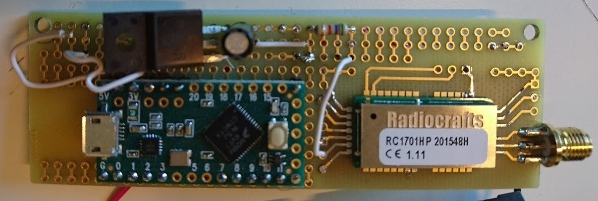
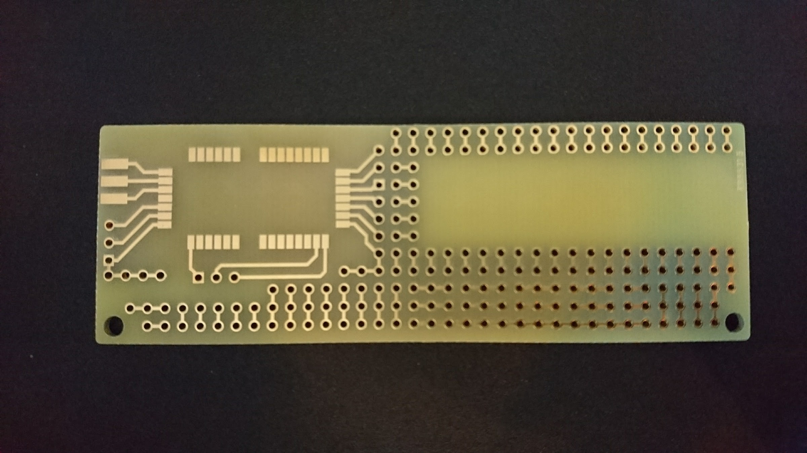
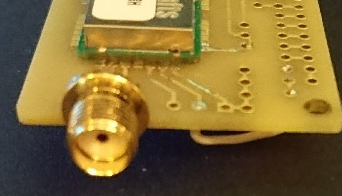
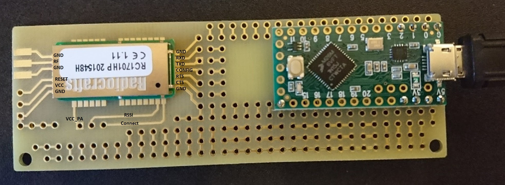
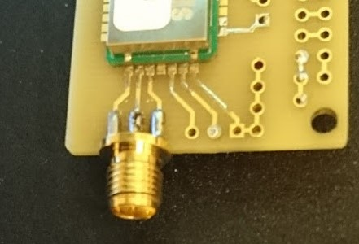
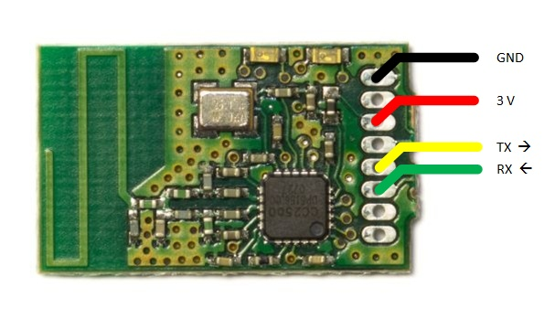

# Building the Radio Unit
Here is info about getting components and putting it together.

## Basic components to get a working unit up for lab/development purposes

### RC1701HP-TM	Tinymesh transciever module

Borrow a couple from me, or buy your own from:
1. http://www.actesolutions.se/sv/produkt/rcxxxx-tm (See how to order from Sweden below.)
2. https://www.digikey.com/product-detail/en/radiocrafts-as/RC1701HP-TM/RC1701HP-TM-ND/7100560 (not possible to ship to sweden)

### PCB with copper pattern for the Tinymesh module footprint
See [PCB Readme](./PCB/README.md) on how to order one.

### SMA female connector for PCB mount
https://www.electrokit.com/sma-hona-pcb-4mm-djup.49423

### Whip antenna for 169MHz with SMA male connector 
https://www.digikey.se/product-detail/en/taoglas-limited/FW.80.SMA.M/931-1195-ND/3664652

### Teensy-LC microcontroller
https://www.electrokit.com/teensy-lc.52909

## Connecting to a Sportident station

SRR module for connecting to SRR BSM station: 
http://www.sportident.se/order.aspx?id=472
To get the actual module (a 1x1 inch circuit board with only the SRR radio and UART connectors) you are supposed to *open up* the plastic enclosure of the dongle and *BREAK THE CIRCUIT BOARD IN HALF*! Yes, it sounds crazy but it's true. There is a notch on either side of the board where you are supposed to break it. If you want to configure if it should transmit on blue or red SRR channel, you need to do that (with SI-Config+) before you break the board.

Alternative: wired connection to RS232 BSM station
- RS232-to-UART converter
https://www.electrokit.com/en/max3232-breakout.49804
- RS323 connector
https://www.electrokit.com/en/dsub-9-conn-male.42706

## Non-mandatory extras
Teensy 3.2 may be an alternative to the Teensy-LC. The LC is cheaper, but the 3.2 has an internal voltage regulator that can feed more current (250mA) to power the Tinymesh module.
https://www.pjrc.com/teensy/external_power.html

I recommend headers for mounting the Teensy on the PCB when in the lab/design phase.
- https://www.electrokit.com/stiftlist-2-54mm-1x40p-brytbar.43412
- https://www.electrokit.com/hylslist-2-54mm-1x40p-svarvad-brytbar.44672

Some LEDs and resistors to connect to RSSI and CONN indicator outputs.

### Tinymesh Demo Kit:
https://www.digikey.com/product-detail/en/radiocrafts-as/RC1701HP-TM-DK/RC1701HP-TM-DK-ND/7100561 
I used a demo kit RC1701HP-TM-DK for the Gateway, since it is a ready made appliance that you just connect to the PC with USB. A demo kit comes with 3 units and costs about 320 USD. But you could also design and build your own gateway unit using a Teensy (which just passes serial straight through) and a Tinymesh module. 

## For maximum outdoor range
To use full transmit power, an additional voltage regulator from the USB's 5V to the Tinymesh VCC_PA that takes 3.3V. I think a buck (switched step-down) converter is better than a linear since it is more energy efficient. It is a tradeoff between battery size and complexity of design. It needs to be able to output >800mA (gut feeling estimate). Note that you may need capacitors too, check the datasheet.

Slim Jim VHF antenna tuned for 169.4MHz with SMA male connector.
http://www.2wayelectronix.com/N9TAX-Original-VHF-Slim-Jim-antenna-VHF-STD.htm

## Ordering Tinymesh in Sweden

I just sent email to Acte Solutions order@actesolutions.se .
They need you to order via a company or organization (their systems require and organization number). I used the org nr of my orienteering club whch worked fine. I just made sure I got the invoices by email so I could pay them myself.

When I ordered 2016 the prices were:
34,50 USD each for the modules RC1701HP-TM, minimum quantity 10 pcs.
320 USD each for the demokit RC1701HP-TM-DK.
Prices excluding VAD and shipping. Shipping was about 100 SEK for me. Country of origin was Norway (where Radiocrafts are).
Delivery took about 3 weeks.

## Putting it together
Connect the following:

| Tinymesh connector | Teensy pin |
| --- | --- |
| RX | TX2 (pin 10) |
| CTS | pin 23 |
| GND | GND |
| VCC | 3.3V |

Do not connect VCC_PA of the Tinymesh to the Teensy 3.3V, since it can not supply the needed amount of current (~400mA). If you want that extra transmit power, you need to add a step-down converter from 5V to 3.3V. Take the 5V from Vin on the Teensy (which is directly connected to the power wire of the USB contact, and feed the resulting 3.3V to VCC_PA on the Tinymesh.

Solder the SMA connector to the three plates at the edge of the PCB. They are GND, RF and GND. Also solder the SMA connector to the GND plane on the back of the PCB.

If you use the Sportident SRR module, you connect the following:

| SRR | Teensy pin |
| --- | --- |
| TX | RX1 (pin 0) |
| GND | GND |
| 3 V | 3.3V |

